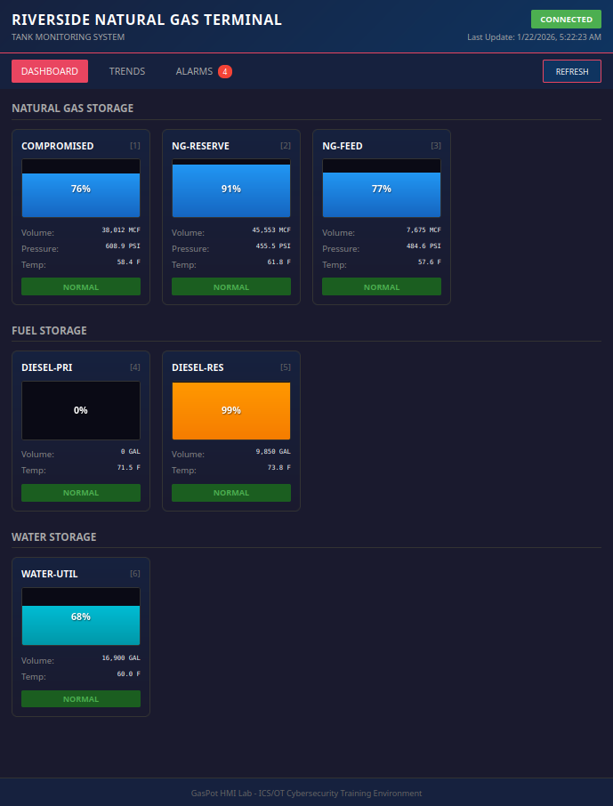
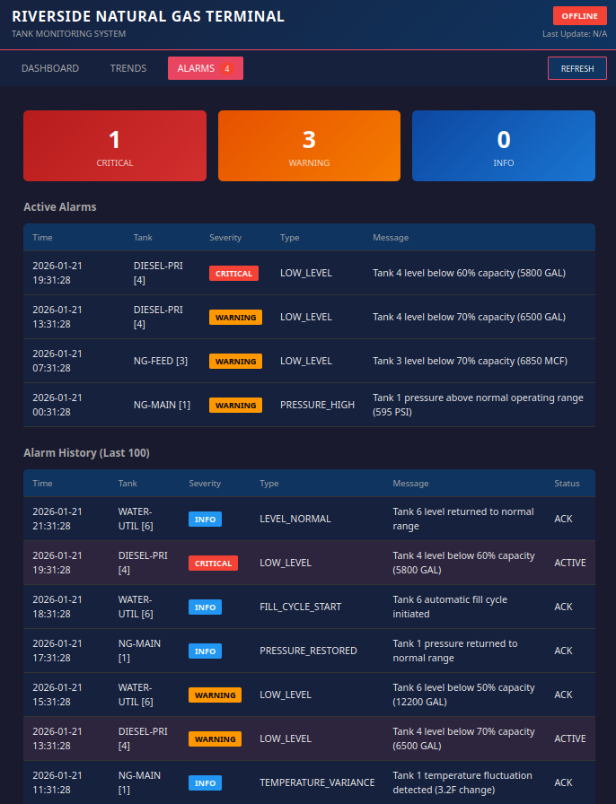
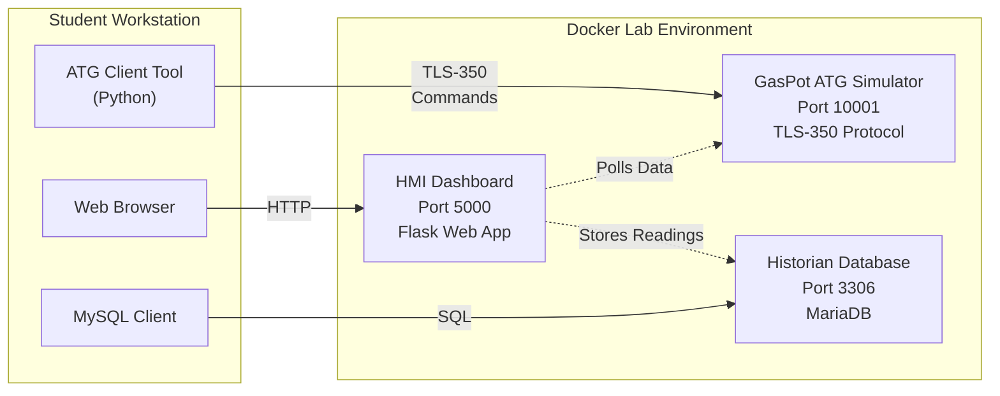

# GasPot HMI Lab

**Learn to hack industrial control systems - safely.**

This hands-on cybersecurity lab simulates a natural gas distribution terminal where you'll enumerate industrial protocols, manipulate tank gauge readings, and exploit database vulnerabilities. These are the same techniques used in real-world ICS/OT attacks - practiced in a safe, isolated environment.

<p align="center">
  <a href="images/hmi_dashboard.png">
    
  </a>
</p>

---

## What You'll Do

**Interact with Real Industrial Protocols**
- Send TLS-350 commands to an Automatic Tank Gauge (ATG) simulator
- Read tank inventory, pressure, temperature, and delivery data
- Modify tank names and volume readings without authentication

**Explore an Operator Interface**
- Navigate a web-based HMI dashboard showing real-time tank status
- Discover API endpoints through browser developer tools
- Watch your ATG manipulations appear in the operator view

**Exploit a Historian Database**
- Connect directly to the time-series database with weak credentials
- Query operational data and historical trends
- Inject false readings and alarms

**Build Attack Chains**
- Combine multiple techniques into coordinated attacks
- Understand the cascading impact on industrial operations
- Document findings as a professional security assessment

---

## What You'll Learn

| Skill | Application |
|-------|-------------|
| ICS Protocol Analysis | TLS-350 (Veeder-Root ATG) - used in thousands of gas stations worldwide |
| Industrial Reconnaissance | Service discovery, protocol enumeration, information gathering |
| Data Manipulation | Modifying operational data without authentication |
| Web Application Testing | API enumeration, information disclosure, session analysis |
| Database Exploitation | SQL injection concepts, credential attacks, data manipulation |
| Security Assessment | Vulnerability documentation, risk analysis, remediation planning |

---

## The Lab Environment

<table>
<tr>
<td width="50%" align="center">

**HMI Dashboard**

<a href="images/hmi_dashboard.png">
  
</a>

Real-time tank monitoring

</td>
<td width="50%" align="center">

**Alarms View**

<a href="images/hmi_alarms.png">
  
</a>

Operational alerts and history

</td>
</tr>
</table>

---

## Architecture



| Component | Description | Port | Technology |
|-----------|-------------|------|------------|
| gaspot-simulator | TLS-350 ATG simulator with 6 tanks | 10001 | Python |
| gaspot-hmi | Web-based operator dashboard | 5000 | Flask |
| gaspot-historian | Time-series database | 3306 | MariaDB |

---

## Requirements

| Requirement | Minimum | Recommended |
|-------------|---------|-------------|
| RAM | 2 GB | 4 GB |
| Disk Space | 2 GB | 5 GB |
| Docker Engine | 20.10+ | Latest |
| Docker Compose | V1 or V2 | V2 |

**Supported Platforms**: Linux (Ubuntu, Kali, Debian), macOS, Windows with WSL2

See [docs/OPERATIONS.md](docs/OPERATIONS.md) for detailed system requirements and troubleshooting.

---

## Quick Start

### 1. Clone and Start

```bash
git clone https://github.com/cutaway-security/gaspot-hmi-lab.git
cd gaspot-hmi-lab
./scripts/start_lab.sh
```

### 2. Access the Lab

| Service | Access |
|---------|--------|
| HMI Dashboard | http://localhost:5000 |
| ATG Simulator | `nc localhost 10001` |
| Database | `docker exec -it gaspot-historian mysql -u lab -ppassword historian` |

### 3. Start the Exercises

Open **[exercises/README.md](exercises/README.md)** and begin your security assessment.

**Estimated time**: ~2.5 hours for core exercises

### 4. When Finished

```bash
./scripts/stop_lab.sh    # Stop the lab
./scripts/reset_lab.sh   # Full reset (wipes data)
```

---

## Documentation

| Document | Audience | Description |
|----------|----------|-------------|
| [exercises/README.md](exercises/README.md) | Students | Start here - exercises and challenges |
| [exercises/docs/PROTOCOL_REFERENCE.md](exercises/docs/PROTOCOL_REFERENCE.md) | Students | TLS-350 protocol commands |
| [exercises/docs/DATABASE_REFERENCE.md](exercises/docs/DATABASE_REFERENCE.md) | Students | Database schema and queries |
| [exercises/INSTRUCTOR_GUIDE.md](exercises/INSTRUCTOR_GUIDE.md) | Instructors | Teaching guide and facilitation tips |
| [docs/OPERATIONS.md](docs/OPERATIONS.md) | Operators | Lab management and troubleshooting |
| [docs/GASPOT_MODIFICATIONS.md](docs/GASPOT_MODIFICATIONS.md) | Developers | Changes from original GasPot |

---

## Quick Reference

### ATG Client Tool

```bash
python3 tools/atg_client.py inventory      # Get tank data
python3 tools/atg_client.py pressure       # Get pressure readings
python3 tools/atg_client.py set-name 1 "X" # Change tank name
python3 tools/atg_client.py --help         # Full usage
```

### Manual ATG Commands

```bash
echo -e '\x01I20100\n' | nc localhost 10001   # Inventory
echo -e '\x01I20600\n' | nc localhost 10001   # Pressure
```

---

## Security Notice

This lab is **intentionally vulnerable** for training purposes:

- No authentication on ATG protocol
- Weak database credentials (lab/password)
- No encryption (HTTP, plain TCP)
- Direct database access enabled

**DO NOT deploy in production environments.**

---

## Credits

- **Original GasPot**: [github.com/sjhilt/GasPot](https://github.com/sjhilt/GasPot) (Kyle Wilhoit, Stephen Hilt)
- **TLS-350 Protocol**: Veeder-Root
- **Research**: [Rapid7 ATG Research](https://www.rapid7.com/blog/post/2015/01/22/the-internet-of-gas-station-tank-gauges/)

### References

- NIST SP 800-82: Guide to ICS Security
- ICS-CERT Advisories
- Veeder-Root TLS-350 Documentation

---

## About

GasPot HMI Lab is developed and maintained by **Cutaway Security, LLC**.

<p align="center">
  <a href="https://www.cutawaysecurity.com">
    
  </a>
</p>

<p align="center">
  <a href="https://www.cutawaysecurity.com">www.cutawaysecurity.com</a>
</p>

---

**Copyright 2026 Cutaway Security, LLC.** Released under CC0 for educational and research use.
